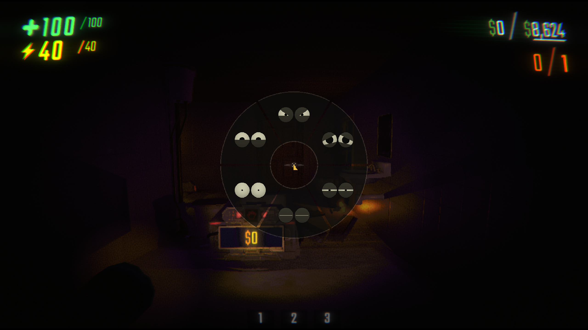

<p align="center">
  
</p>

<h1 align="center">Refined Emotions</h1>

<p align="center"><i><b>Express</i></b> yourself to your mates in R.E.P.O</p>

## Usage
Hold `Middle Mouse Button` (scroll wheel) to choose an emote.  
Hold `V` to see yourself.  
Configure keys via `Menu` > `Mods` > `Refined Emotions`

## Install

<!-- TODO: Add the Thunderstore download button after publishing. -->

## Build

```bash
./scripts/bootstrap.sh # Download the local .NET SDK and BepInEx build dependencies
./scripts/test.sh      # Run automated checks

./scripts/build.sh     # Build dist/RepoEmoteWheel.dll
# Or build the DLL and a ready-to-upload Thunderstore ZIP in dist/:
python3 scripts/package.py
```
